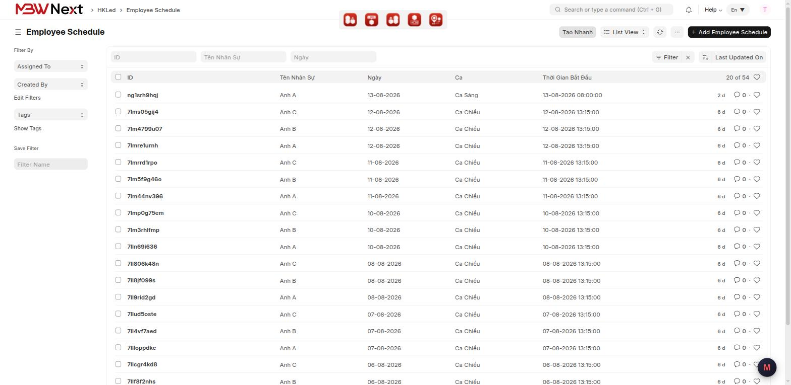
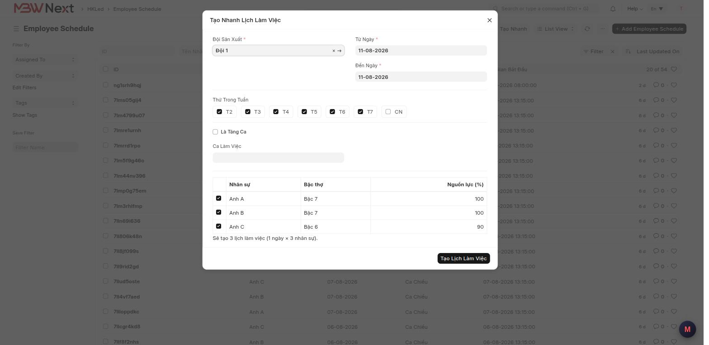
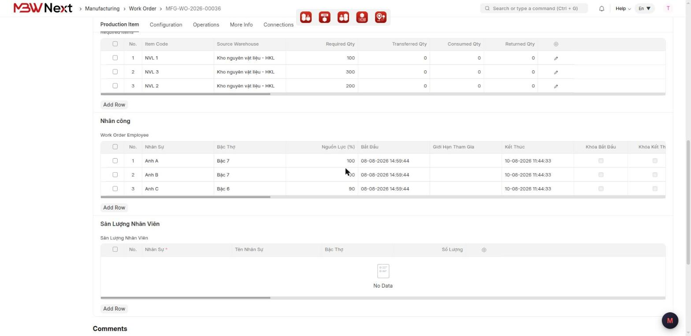

# Hướng dẫn sử dụng: Bậc Thợ & Lịch Sản Xuất

> **Phạm vi:** App `mbwnext_hkled` — dành riêng khách HKLED
> **Đối tượng:** Quản lý sản xuất, tổ trưởng, nhân viên kế hoạch
> **Cập nhật:** 2026-08-11
> **Mục đích:** Xếp lịch làm việc cho cả đội chỉ bằng vài cú bấm, biết trước lệnh sản xuất bao giờ
> xong, và ghi nhận sản lượng từng người khi hoàn thành.

Phần khai danh mục nền (Bậc Thợ, ca, đội, hồ sơ nhân sự) là việc của quản trị hệ thống, làm một
lần lúc go-live — xem [bac-tho-lich-san-xuat-cau-hinh.md](bac-tho-lich-san-xuat-cau-hinh.md).

---

## Mục lục

1. [Tính năng này dùng để làm gì](#1-tính-năng-này-dùng-để-làm-gì)
2. [Chuẩn bị trước khi dùng](#2-chuẩn-bị-trước-khi-dùng)
3. [Tạo nhanh lịch làm việc cho cả đội](#3-tạo-nhanh-lịch-làm-việc-cho-cả-đội)
4. [Từ đơn hàng tới lệnh sản xuất](#4-từ-đơn-hàng-tới-lệnh-sản-xuất)
5. [Thêm người vào lệnh sản xuất](#5-thêm-người-vào-lệnh-sản-xuất)
6. [Bắt đầu sản xuất](#6-bắt-đầu-sản-xuất)
7. [Khi hoàn thành — sản lượng và số serial](#7-khi-hoàn-thành--sản-lượng-và-số-serial)
8. [Công Việc Khác — việc ngoài lệnh sản xuất](#8-công-việc-khác--việc-ngoài-lệnh-sản-xuất)
9. [Thông báo lỗi thường gặp](#9-thông-báo-lỗi-thường-gặp)
10. [Câu hỏi thường gặp](#10-câu-hỏi-thường-gặp)

---

## 1. Tính năng này dùng để làm gì

Trước đây muốn xếp lịch cho công nhân phải tạo tay từng bản ghi cho từng người từng ngày; muốn
biết lệnh sản xuất bao giờ xong thì tự nhẩm; hoàn thành xong thì ghi sản lượng ra ngoài Excel.

Bộ tính năng này gom lại thành ba việc:

- **Xếp lịch hàng loạt** — chọn đội, chọn khoảng ngày, chọn thứ trong tuần, hệ thống tạo hết.
- **Tính giờ hoàn thành** — dựa trên số lượng, thời gian sản xuất một sản phẩm và **năng lực thật**
  của những người tham gia (Bậc Thợ cao thì làm nhanh hơn).
- **Ghi nhận sản lượng** — khi lệnh hoàn thành, hệ thống tự chia sản lượng cho từng người và sinh
  số serial cho thành phẩm.

**Ví dụ tình huống:** Đơn 20 cái, mỗi cái 10 phút, giao cho 3 người có Bậc Thợ 100% + 100% + 90%.
Hệ thống tính ra **69 phút** và chỉ đúng giờ kết thúc dự kiến, thay vì đoán "khoảng đầu giờ chiều".

---

## 2. Chuẩn bị trước khi dùng

**Quyền cần có:** `Manufacturing User` trở lên. Riêng việc tạo/sửa **Đội Sản Xuất** cần
`Manufacturing Manager`.

**Phải có sẵn** — thiếu cái nào thì vấp lỗi ở mục 9:

| Cần có | Ai khai |
|---|---|
| Công nhân đã có **Bậc Thợ** và **Đội Sản Xuất** trong hồ sơ | quản trị / nhân sự |
| Ca làm việc (Ca Sáng, Ca Chiều) | quản trị |
| Thành phẩm đã khai **Thời Gian Sản Xuất (Phút)** | quản trị |

---

## 3. Tạo nhanh lịch làm việc cho cả đội

Đây là việc dùng nhiều nhất, thường làm đầu tuần hoặc đầu tháng.

### Bước 1 — Mở hộp thoại

Vào **Employee Schedule** → bấm **Tạo Nhanh** trên thanh công cụ.

### Bước 2 — Điền hộp thoại

| Trường | Cách điền |
|---|---|
| **Đội Sản Xuất** | chọn đội. Chọn xong danh sách nhân sự hiện ra ngay bên dưới |
| **Từ Ngày** / **Đến Ngày** | khoảng ngày cần tạo lịch. Tối đa **62 ngày** một lần |
| **Thứ Trong Tuần** | mặc định tick T2–T7, bỏ CN. Bỏ tick thứ nào thì **không tạo lịch** cho thứ đó |
| **Là Tăng Ca** | chỉ tick khi làm ngoài ca. Tick xong phải nhập **Bắt Đầu** và **Kết Thúc** |
| **Ca Làm Việc** | chọn ca. **Không** tick tăng ca thì bắt buộc phải chọn |
| Danh sách nhân sự | mặc định tick hết. Bỏ tick ai thì người đó không được tạo lịch |

Dòng chữ ngay dưới danh sách cho biết **sẽ tạo bao nhiêu bản ghi** trước khi bấm — ví dụ
*"Sẽ tạo 3 lịch làm việc (1 ngày × 3 nhân sự)."* Nếu khoảng ngày có thứ bị bỏ tick, dòng này ghi
rõ đã bỏ qua bao nhiêu ngày.

### Bước 3 — Tạo

Bấm **Tạo Lịch Làm Việc**.

Kết quả hiện ra một bảng tổng kết: đã tạo bao nhiêu, và **bỏ qua** những dòng nào kèm lý do.

> ⚠️ Người đã có lịch trong ngày đó sẽ bị **bỏ qua**, không bị ghi đè. Đây là cố ý — chạy lại
> Tạo Nhanh cho cùng khoảng ngày sẽ không tạo ra lịch trùng.

---

## 4. Từ đơn hàng tới lệnh sản xuất

Ba thông tin sản xuất đi theo chứng từ, khai một lần ở Đơn Bán Hàng là chảy xuống hết.

### Bước 1 — Trên Đơn Bán Hàng

Mở **Sales Order**, ở mục thông tin sản xuất điền:

| Trường | Ý nghĩa |
|---|---|
| **Thời Gian Bắt Đầu** | dự kiến bắt đầu làm từ lúc nào |
| **Giờ Cần Hoàn Thành** | giờ trong ngày giao hàng, ví dụ `17:00` |
| **Ghi Chú Sản Xuất** | dặn dò cho xưởng |

Lưu và duyệt đơn.

### Bước 2 — Trên Kế Hoạch Sản Xuất

Tạo **Production Plan** từ đơn trên. Trong bảng **Sales Orders**, mỗi dòng đơn có thêm ô
**Đội Sản Xuất** — chọn đội sẽ làm.

Hệ thống tự tính **Thời Điểm Cần Hoàn Thành** = Ngày Giao Hàng ghép với Giờ Cần Hoàn Thành đã khai
ở bước 1.

Lưu và duyệt kế hoạch.

### Bước 3 — Tạo lệnh sản xuất

Trên Kế Hoạch bấm **Create** → **Work Order**.

Lệnh sinh ra **tự có sẵn**:

- **Thời Gian Bắt Đầu** và **Thời Điểm Cần Hoàn Thành** lấy từ kế hoạch
- Bảng nhân công **đã có đủ người của đội**, kèm **Bậc Thợ** và **Nguồn Lực (%)**

> Bảng nhân công trên lệnh mang nhãn **Work Order Employee**, nằm trong mục **Nhân công**.

---

## 5. Thêm người vào lệnh sản xuất

Khi cần bổ sung người, hoặc lệnh tạo tay không đi từ kế hoạch:

1. Mở lệnh sản xuất
2. Bấm **Thêm Đội Sản Xuất** trên thanh công cụ
3. Chọn **Đội Sản Xuất** → danh sách nhân sự hiện ra
4. Tick những người cần thêm → **Xác Nhận**

Người **đã có** trong bảng sẽ hiện mờ kèm chữ *"đã có trong bảng"* và không tick được — không lo
thêm trùng.

Thêm xong vẫn **sửa hoặc xoá từng dòng tự do**. Người chuyển đội sau này cũng không làm đổi lệnh
đã tạo.

---

## 6. Bắt đầu sản xuất

Khi xưởng thật sự bắt tay vào làm:

1. Lệnh phải đã **duyệt** và đang ở trạng thái **In Process** (đã chuyển nguyên vật liệu)
2. Bấm **Bắt Đầu Sản Xuất**
3. Hộp xác nhận hiện ra — đọc kỹ rồi bấm **Yes**

Hệ thống ghi **Thời Gian Bắt Đầu** = giờ hiện tại, rồi tính lại toàn bộ lịch theo giờ thật:
điền **Tổng Thời Gian Dự Kiến (Phút)** và **Thời Gian Kết Thúc Dự Kiến**.

> ⚠️ **Chỉ bấm được một lần và không hoàn tác được.** Bấm xong nút tự ẩn đi.

Nút **không hiện** khi lệnh còn nháp hoặc chưa vào In Process — đó là bình thường, không phải lỗi.

**Tính Lại Lịch** là nút riêng, bấm bao nhiêu lần cũng được: dùng khi thêm/bớt người hoặc đổi số
lượng và muốn xem lại giờ kết thúc.

---

## 7. Khi hoàn thành — sản lượng và số serial

Làm phiếu **Manufacture** cho đủ số lượng như thường lệ. Khi lệnh chuyển sang **Completed**, hệ
thống tự làm hai việc:

**Chia sản lượng.** Bảng **Sản Lượng Nhân Viên** trên lệnh được điền tự động, chia đều cho những
người trong bảng nhân công, phần dư dồn vào dòng đầu. Ví dụ 20 cái cho 3 người → **8 / 6 / 6**.

Sửa tay được, nhưng **tổng các dòng phải đúng bằng số lượng đã sản xuất**, lệch là không lưu được.

**Sinh số serial.** Mỗi thành phẩm được cấp một số theo dạng `26-00002-0001`: hai số đầu là năm,
phần giữa rút gọn từ mã đơn bán, bốn số cuối chạy tuần tự. Lệnh **không gắn đơn bán** thì lấy mã
lệnh làm gốc và thêm chữ `W` ở đầu: `W26-00042-0001`. Xem tại **Serial No**.

> ⚠️ **Từ 08/08/2026 định dạng này đang sai** vì mã chứng từ đã đổi (PM-TASK-00054): đơn bán
> `SO-26-00001` cho ra serial `SO-26-00001-0001` thay vì `26-00001-0001`, lệnh sản xuất
> `LSX-26-00001` cho ra `WLSX-26-00001-0001`. Không gây lỗi và không sinh serial trùng, nhưng
> không đúng dạng đã chốt với HKLED ngày 02/08. Đang chờ xử lý — xem ghi chú trong
> `controllers/python_hook/stock_entry.py`.

Ngoài ra, giờ kết thúc trong **Employee Allocation** được co lại từ giờ dự kiến về **giờ hoàn thành
thật**, để biểu đồ lịch làm việc phản ánh đúng thực tế.

---

## 8. Công Việc Khác — việc ngoài lệnh sản xuất

Dùng để ghi nhận và tính lương cho việc không gắn với lệnh sản xuất nào: dọn xưởng, sửa máy, kiểm kê…

1. Thanh tìm kiếm → gõ `Other Task` → **Add Other Task**
2. Điền **Tên Công Việc**, **Ngày**, **Tổng Thời Gian (Phút)**
3. Ở bảng **Nhân Công Tham Gia**, thêm những người tham gia — **để trống cột thời gian**
4. **Save**

Hệ thống **tự chia đều** tổng thời gian cho số người, rồi tính tiền công theo Lương Mỗi Phút của
Bậc Thợ từng người và cộng ra **Tổng Lương Nhân Công**.

Ví dụ 90 phút cho 3 người → mỗi người 30 phút. Bậc 7 (1.080đ/phút) được 32.400đ, Bậc 6 (920đ/phút)
được 27.600đ, tổng **92.400đ**.

Muốn chia không đều thì nhập tay từng dòng, nhưng **tổng phải đúng bằng Tổng Thời Gian**.

---

## 9. Thông báo lỗi thường gặp

| Thông báo | Nguyên nhân | Cách xử lý |
|---|---|---|
| *Chưa chọn nhân sự nào* | Đã bỏ tick hết người trong hộp thoại Tạo Nhanh | Tick lại ít nhất một người |
| *Chưa chọn thứ nào trong tuần* | Bỏ tick cả 7 thứ | Tick ít nhất một thứ |
| *Đến Ngày phải từ Từ Ngày trở đi* | Nhập ngược khoảng ngày | Sửa lại **Đến Ngày** cho bằng hoặc sau **Từ Ngày** |
| *Khoảng N ngày, vượt quá 62 ngày cho phép* | Khoảng ngày quá dài | Chia thành nhiều lần, mỗi lần tối đa 62 ngày |
| *Không ngày nào trong khoảng khớp thứ đã chọn* | Ví dụ khoảng chỉ có Chủ nhật mà lại bỏ tick CN | Mở rộng khoảng ngày, hoặc tick thêm thứ |
| *Tăng ca phải nhập Bắt Đầu và Kết Thúc* | Đã tick **Là Tăng Ca** nhưng bỏ trống giờ | Nhập **Bắt Đầu** và **Kết Thúc** |
| *Vui lòng chọn Ca Làm Việc* | Không tick tăng ca mà cũng không chọn ca | Chọn **Ca Làm Việc**, hoặc tick **Là Tăng Ca** rồi nhập giờ |
| *Bạn không có quyền tạo lịch cho nhân sự: **X*** | Trong lô có người ngoài phạm vi được phép của bạn | Bỏ tick những người đó, hoặc nhờ quản trị cấp thêm quyền |
| *Chỉ bắt đầu sản xuất được khi Lệnh sản xuất đã được duyệt* | Lệnh còn nháp | Bấm **Submit** trước |
| *Chỉ ấn được khi Lệnh sản xuất đang ở trạng thái In Process (hiện tại: **X**)* | Chưa chuyển nguyên vật liệu nên lệnh chưa vào In Process | Làm phiếu chuyển nguyên vật liệu trước |
| *Lệnh sản xuất này đã được bắt đầu rồi, không ấn lại được* | Đã bấm **Bắt Đầu Sản Xuất** trước đó | Không cần làm gì. Muốn tính lại giờ thì dùng nút **Tính Lại Lịch** |
| *Vui lòng nhập Thời Gian Bắt Đầu cho Work Order* | Lệnh chưa có Thời Gian Bắt Đầu | Điền **Thời Gian Bắt Đầu** rồi bấm lại |
| *Chưa có nhân sự nào trong Bảng Nhân Công Tham Gia* | Lệnh chưa có ai để tính lịch | Bấm **Thêm Đội Sản Xuất** để thêm người |
| *Row #N: Nhân sự **X** bị trùng trong Bảng Nhân Công Tham Gia* | Một người bị thêm hai lần | Xoá dòng thừa |
| *Row #N: đã Khóa Bắt Đầu nhưng chưa nhập Bắt Đầu* | Tick khoá mà bỏ trống giờ | Nhập giờ **Bắt Đầu**, hoặc bỏ tick **Khóa Bắt Đầu** |
| *Row #N: đã Khóa Kết Thúc nhưng chưa nhập Kết Thúc* | Như trên, với giờ kết thúc | Nhập giờ **Kết Thúc**, hoặc bỏ tick **Khóa Kết Thúc** |
| *Không đủ Lịch làm việc của nhân sự để hoàn thành khối lượng công việc…* | Tổng giờ có lịch ít hơn khối lượng cần làm | Dùng **Tạo Nhanh** tạo thêm lịch cho ngày kế tiếp, hoặc thêm người vào lệnh |
| *Tổng thời gian các dòng (X phút) phải bằng Tổng Thời Gian (Y phút). Đang vượt/thiếu Z phút.* | Sửa tay dòng Công Việc Khác làm lệch tổng | Sửa lại các dòng cho khớp, hoặc đổi **Tổng Thời Gian (Phút)** |
| *Tổng Sản Lượng Nhân Viên (X cái) phải bằng Số Lượng Đã Sản Xuất (Y cái). Đang vượt/thiếu Z cái.* | Sửa tay bảng sản lượng làm lệch | Sửa lại cho tổng đúng bằng số đã sản xuất |

Các lỗi còn lại — thiếu Bậc Thợ, mặt hàng chưa khai Thời Gian Sản Xuất, nhân sự chưa có Nguồn Lực —
là **thiếu cấu hình**, xem [file cấu hình](bac-tho-lich-san-xuat-cau-hinh.md#9-thông-báo-lỗi-thường-gặp).

---

## 10. Câu hỏi thường gặp

**Hỏi:** Chạy Tạo Nhanh hai lần cho cùng một khoảng ngày có bị lịch trùng không?
**Đáp:** Không. Người đã có lịch ngày đó sẽ bị bỏ qua và ghi rõ trong bảng kết quả.

**Hỏi:** Bấm nhầm **Bắt Đầu Sản Xuất** thì sao?
**Đáp:** Không hoàn tác được. Thời Gian Bắt Đầu đã ghi là giờ thật lúc bấm. Nếu sai nhiều, nhờ
quản trị sửa lại trường **Thời Gian Bắt Đầu** rồi bấm **Tính Lại Lịch**.

**Hỏi:** Vì sao đội của tôi mở ra không thấy ai?
**Đáp:** Danh sách chỉ lấy người **Active**, **Loại Nhân Sự = Công nhân**, và có **Đội Sản Xuất**
đúng đội đó. Thiếu một trong ba thì không hiện. Nhờ nhân sự kiểm lại hồ sơ.

**Hỏi:** Hai người cùng bậc mà sao chia sản lượng lệch nhau?
**Đáp:** Hệ thống chia đều, phần dư dồn vào dòng đầu tiên. 20 cái cho 3 người ra 8/6/6 chứ không
phải 6,67 mỗi người. Sửa tay được, miễn tổng đúng.

**Hỏi:** Đổi số lượng trên lệnh rồi thì giờ kết thúc có tự đổi không?
**Đáp:** Không tự đổi. Bấm **Tính Lại Lịch** để cập nhật.

**Hỏi:** Tôi muốn ngừng dùng một đội cũ.
**Đáp:** Đừng xoá — mở đội đó bỏ tick **Đang Hoạt Động**. Đội sẽ biến khỏi các ô chọn nhưng dữ liệu
cũ vẫn nguyên.

---

## Liên quan

- [Hướng dẫn cấu hình](bac-tho-lich-san-xuat-cau-hinh.md) — khai danh mục nền, phân quyền
- [Biểu đồ tình hình làm việc của nhân sự](bieu-do-gantt-lich-lam-viec-van-hanh.md) — xem lịch đã xếp trên một màn hình
- Đầu bài và thiết kế: `apps/mbwnext_hkled/docs/features/bac-tho-lich-san-xuat.md`
- Bộ test case: `apps/mbwnext_hkled/docs/testcases/bac-tho-lich-san-xuat.md`
