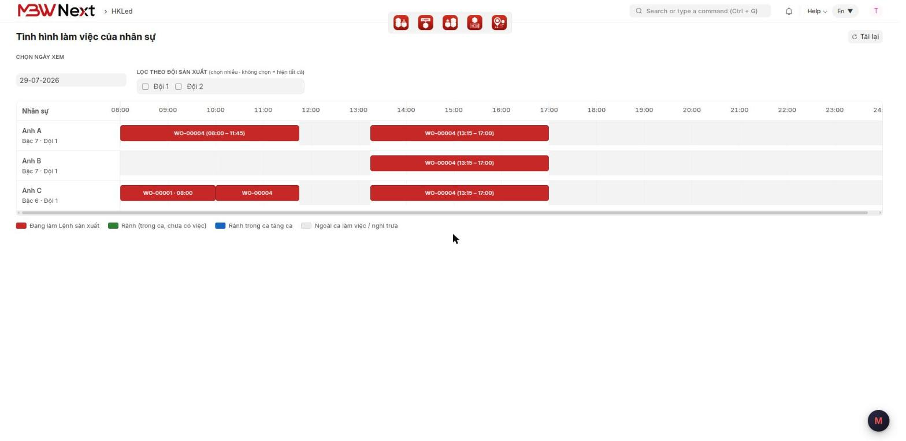
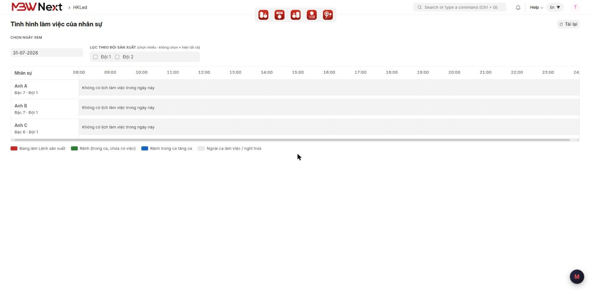

# Hướng dẫn sử dụng: Biểu đồ tình hình làm việc của nhân sự

> **Phạm vi:** App `mbwnext_hkled` — dành riêng khách HKLED
> **Đối tượng:** Quản lý sản xuất, tổ trưởng — người sắp việc cho công nhân
> **Cập nhật:** 2026-08-08
> **Mục đích:** Nhìn một màn hình là biết trong ngày ai đang làm lệnh sản xuất nào, từ mấy giờ tới
> mấy giờ, và còn trống khoảng nào để giao thêm việc.

---

## Mục lục

1. [Tính năng này dùng để làm gì](#1-tính-năng-này-dùng-để-làm-gì)
2. [Chuẩn bị trước khi dùng](#2-chuẩn-bị-trước-khi-dùng)
3. [Các bước thực hiện](#3-các-bước-thực-hiện)
4. [Đọc biểu đồ](#4-đọc-biểu-đồ)
5. [Kiểm tra kết quả](#5-kiểm-tra-kết-quả)
6. [Thông báo thường gặp trên màn hình](#6-thông-báo-thường-gặp-trên-màn-hình)
7. [Câu hỏi thường gặp](#7-câu-hỏi-thường-gặp)

---

## 1. Tính năng này dùng để làm gì

Trước đây muốn biết một công nhân trong ngày đang bận việc gì, phải mở từng **Lệnh Sản Xuất**
(*Work Order*) hoặc lọc bảng **Phân Công Nhân Sự** (*Employee Allocation*) rồi tự cộng giờ. Màn
hình này gom tất cả vào một biểu đồ theo ngày: mỗi người một dòng, kéo dài theo trục giờ.

Màn hình **chỉ để xem**. Không tạo, không sửa, không xoá bất cứ dữ liệu nào — bấm thoải mái không
sợ hỏng số liệu.

**Ví dụ tình huống:** Sáng thứ Hai có đơn gấp cần chen vào. Mở màn hình này, chọn ngày hôm đó, nhìn
ngay ra ai còn khoảng xanh trong ca chiều để giao việc, thay vì mở lần lượt 5 lệnh sản xuất đang chạy.

---

## 2. Chuẩn bị trước khi dùng

**Quyền cần có:** một trong ba vai trò `System Manager`, `Manufacturing Manager`, `Manufacturing User`.
Không có vai trò nào trong số đó thì màn hình không hiện trong danh sách.

**Dữ liệu phải khai trước** — thiếu cái nào thì biểu đồ vẫn mở được nhưng sẽ trống ở phần tương ứng:

| Cần khai | Ở đâu | Nếu thiếu |
|---|---|---|
| Nhân sự có **Loại Nhân Sự** = *Công nhân* | **Nhân Sự** (*Employee*) | người đó **không hiện** trên biểu đồ |
| **Đội Sản Xuất** của nhân sự | **Nhân Sự**, ô *Đội Sản Xuất* | vẫn hiện, nhưng lọc theo đội sẽ không ra |
| **Lịch Làm Việc** của ngày cần xem | **Lịch Làm Việc** (*Employee Schedule*) | dòng của người đó xám toàn bộ |
| **Phân Công Nhân Sự** | tự sinh khi bấm *Tính Lại Lịch* trên Lệnh Sản Xuất | không có thanh đỏ nào |

> 💡 Lịch làm việc cho cả đội tạo nhanh được: vào danh sách **Lịch Làm Việc**, bấm **Tạo Nhanh**,
> chọn đội và khoảng ngày.

---

## 3. Các bước thực hiện

### Bước 1 — Mở màn hình

Vào workspace **HKLed** ở thanh bên trái, bấm lối tắt **Tình Hình Làm Việc**.

Hoặc gõ *Tình hình làm việc của nhân sự* vào ô tìm kiếm trên cùng.

### Bước 2 — Chọn ngày cần xem

Ô **Chọn ngày xem** ở góc trên bên trái, mặc định là ngày hôm nay. Đổi ngày thì biểu đồ tự vẽ lại,
không phải bấm thêm nút nào.

### Bước 3 — Lọc theo đội (tuỳ chọn)

Ô **Lọc theo Đội Sản Xuất** cho **tích nhiều đội** cùng lúc. Tích đội nào thì chỉ hiện thành viên
của các đội đó.

**Bỏ tích hết** = hiện tất cả công nhân. Đây cũng là trạng thái lúc mới mở màn hình.

### Bước 4 — Xem chi tiết một khoảng

- **Đưa chuột** lên một thanh bất kỳ: hiện tên nhân sự, mã lệnh sản xuất, mặt hàng, số lượng,
  trạng thái lệnh, khoảng giờ và tên ca.
- **Bấm vào thanh đỏ**: mở thẳng Lệnh Sản Xuất tương ứng.

> ⚠️ Không kéo thả được các thanh trên biểu đồ, và đó là cố ý. Muốn đổi lịch thì mở Lệnh Sản Xuất
> rồi bấm **Tính Lại Lịch** — kéo thả thẳng trên biểu đồ sẽ làm lệnh sản xuất lệch khỏi phân công.

### Bước 5 — Cập nhật lại số liệu

Bấm **Tải lại** ở góc trên bên phải nếu vừa có người khác đổi lịch hoặc tính lại lệnh sản xuất.
Biểu đồ **không** tự cập nhật khi dữ liệu đổi ở máy khác.

---

## 4. Đọc biểu đồ

Trục ngang cố định từ **08:00 đến 24:00**. Mỗi nhân sự một dòng, dưới tên có ghi *bậc thợ · đội*.

| Màu | Nghĩa |
|---|---|
| 🟥 **Đỏ** | Đang làm một Lệnh Sản Xuất. Trên thanh ghi mã lệnh và khoảng giờ |
| 🟩 **Xanh lá** | Rảnh — đang trong ca làm việc nhưng chưa có việc nào |
| 🟦 **Xanh dương** | Rảnh trong ca tăng ca |
| ⬜ **Xám** | Ngoài ca làm việc: nghỉ trưa, chưa tới giờ làm, đã tan ca, hoặc hôm đó không có lịch |

**Phân biệt xám và xanh lá** là chỗ hay nhầm nhất:

- **Xanh lá** = người này *đang đi làm* và *đang rảnh* → giao việc được.
- **Xám** = người này *không đi làm* trong khoảng đó → không giao việc được.

Nhìn ảnh ở Bước 2: khoảng **11:45–13:15** của cả ba người là xám vì đó là giờ nghỉ trưa, không phải
họ rảnh. Riêng **Anh B** cả buổi sáng cũng xám vì hôm đó anh ấy chỉ có ca chiều.

> 💡 Một lệnh sản xuất kéo dài nhiều ngày sẽ hiện **thành nhiều mảnh**, mỗi ngày một mảnh. Xem ngày
> nào thì chỉ thấy phần thuộc ngày đó.

---

## 5. Kiểm tra kết quả

Biết mình đang nhìn đúng số liệu khi:

- Tổng các thanh đỏ của một người trong một lệnh **khớp** với bảng *Nhân Công Tham Gia* trên chính
  Lệnh Sản Xuất đó.
- Thanh đỏ **không bao giờ** nằm trên vùng xám. Nếu thấy thanh đỏ vắt qua giờ nghỉ trưa thì báo lại
  đội kỹ thuật — đó là dấu hiệu sai.
- Lệnh sản xuất đã **Huỷ** thì không còn xuất hiện trên biểu đồ.

---

## 6. Thông báo thường gặp trên màn hình

Màn hình này không có thông báo lỗi đỏ nào, vì nó chỉ đọc dữ liệu. Các câu dưới đây là **thông báo
bình thường**, không phải lỗi:

| Thông báo | Nguyên nhân | Cách xử lý |
|---|---|---|
| *Không có lịch làm việc trong ngày này* | Nhân sự đó chưa được khai **Lịch Làm Việc** cho ngày đang xem | Vào danh sách **Lịch Làm Việc**, bấm **Tạo Nhanh** để tạo cho cả đội, hoặc bấm **Add** tạo từng dòng |
| *Không có nhân sự nào thuộc đội đã chọn.* | Đội vừa tích chưa có ai, hoặc thành viên chưa được đặt **Loại Nhân Sự** = *Công nhân* | Mở **Nhân Sự**, kiểm ô *Đội Sản Xuất* và *Loại Nhân Sự* của những người cần hiện |
| *Chưa khai báo Đội Sản Xuất nào* | Hệ thống chưa có bản ghi **Đội Sản Xuất** nào đang hoạt động | Vào **Đội Sản Xuất** (*Work Team*) tạo đội, nhớ tích *Đang Hoạt Động* |
| *Chưa gán bậc thợ / đội* (hiện dưới tên người) | Nhân sự đó chưa có **Bậc Thợ** hoặc chưa thuộc đội nào | Mở hồ sơ **Nhân Sự**, điền *Bậc Thợ* và *Đội Sản Xuất* |

---

## 7. Câu hỏi thường gặp

**Hỏi:** Tôi sửa lịch làm việc xong mà biểu đồ vẫn như cũ?
**Đáp:** Bấm **Tải lại** ở góc trên bên phải. Biểu đồ chỉ lấy số liệu lúc mở màn hình hoặc lúc đổi
ngày, không tự cập nhật theo thời gian thực.

**Hỏi:** Vì sao nhân viên kế toán và nhân viên bán hàng không hiện?
**Đáp:** Cố ý. Biểu đồ chỉ hiện nhân sự có **Loại Nhân Sự** = *Công nhân*, vì đây là biểu đồ dành
cho sản xuất.

**Hỏi:** Người nghỉ hôm đó có hiện không?
**Đáp:** Có, vẫn hiện đủ tên và bậc thợ, phần thời gian để xám toàn bộ kèm chữ *Không có lịch làm
việc trong ngày này*. Cố ý để vậy để quản lý thấy đủ quân số chứ không phải đoán ai bị thiếu.

**Hỏi:** Trục giờ chỉ tới 24:00, ca đêm qua hôm sau thì sao?
**Đáp:** Phần sau 24:00 sẽ nằm ở ngày kế tiếp. Chọn ngày hôm sau để xem phần còn lại.

**Hỏi:** Tôi mở biểu đồ nhưng chỉ thấy đúng một người, đồng nghiệp mở lại thấy đủ?
**Đáp:** Tài khoản của bạn đang bị giới hạn quyền xem hồ sơ nhân sự. Đây là thiết lập phân quyền,
không phải lỗi — liên hệ quản trị hệ thống nếu cần xem đủ.

**Hỏi:** Có in được biểu đồ này không?
**Đáp:** Chưa có nút in. Dùng chức năng in của trình duyệt (Ctrl+P) hoặc chụp màn hình.

---

## Liên quan

- Cách sắp lịch và tính lại giờ cho một lệnh sản xuất: xem tài liệu vận hành của phần
  **Bậc Thợ & Lịch Sản Xuất**.
- Mô tả kỹ thuật và các quyết định thiết kế: `docs/features/bieu-do-gantt-lich-lam-viec.md`.
