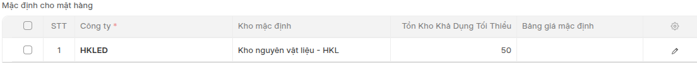
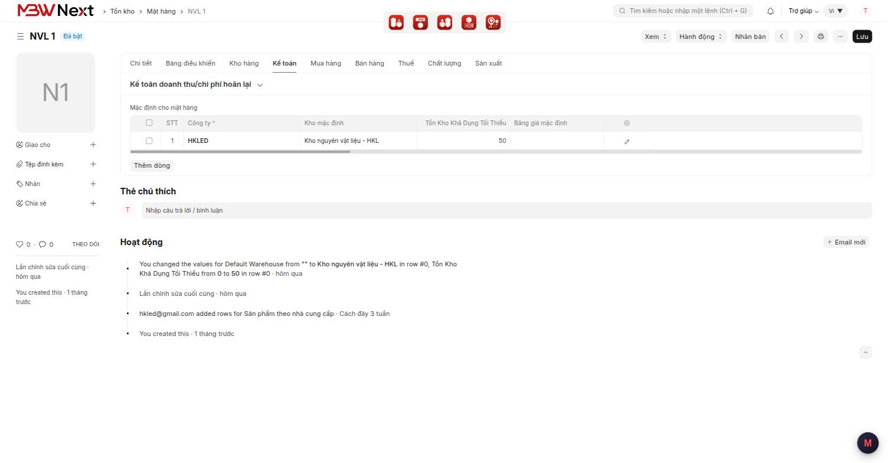

# Hướng dẫn sử dụng: Khai kho mặc định và tồn tối thiểu theo công ty

> **Phạm vi:** App `mbwnext_hkled` — dành riêng khách HKLED
> **Đối tượng:** Người phụ trách danh mục mặt hàng, thủ kho
> **Cập nhật:** 2026-09-04
> **Mục đích:** Khai được **kho mặc định** và **tồn tối thiểu** cho một mặt hàng, theo từng công ty.

---

## Mục lục

1. [Tính năng này dùng để làm gì](#1-tính-năng-này-dùng-để-làm-gì)
2. [Chuẩn bị trước khi dùng](#2-chuẩn-bị-trước-khi-dùng)
3. [Các bước thực hiện](#3-các-bước-thực-hiện)
4. [Kiểm tra kết quả](#4-kiểm-tra-kết-quả)
5. [Thông báo lỗi thường gặp](#5-thông-báo-lỗi-thường-gặp)
6. [Câu hỏi thường gặp](#6-câu-hỏi-thường-gặp)

---

## 1. Tính năng này dùng để làm gì

Mỗi mặt hàng cần khai hai thứ **theo từng công ty**:

- **Kho mặc định** — chứng từ của công ty đó sẽ tự chọn kho này.
- **Tồn Kho Khả Dụng Tối Thiểu** — mức tồn thấp nhất muốn giữ ở công ty đó.

**Ví dụ tình huống:** `NVL 1` để kho mặc định là *Kho nguyên vật liệu* và tồn tối thiểu **50**.
Từ đó, khi hệ thống lập Yêu cầu mặt hàng cho `NVL 1` thì tự điền đúng kho ấy, và khi tính
nhu cầu vật tư theo kỳ thì hiểu là phải luôn còn ít nhất 50 chiếc.

---

## 2. Chuẩn bị trước khi dùng

- **Quyền cần có:** quyền **sửa Mặt hàng**. Ai chỉ xem được Mặt hàng thì đọc được bảng
  nhưng không khai được.
- **Dữ liệu phải có trước:** Công ty và Kho đã khai xong.
- Khai hàng loạt cho cả danh mục: xem
  [khai-kho-mac-dinh-va-ton-toi-thieu-cau-hinh.md](khai-kho-mac-dinh-va-ton-toi-thieu-cau-hinh.md)
  — **đọc trước khi nhập Excel**, có một cái bẫy xoá mất dữ liệu.

---

## 3. Các bước thực hiện

### Bước 1 — Mở mặt hàng cần khai

1. Gõ **Mặt hàng** vào ô tìm kiếm trên cùng, chọn mặt hàng.
2. Chuyển sang tab **Kế toán**.
3. Kéo tới bảng **Mặc định cho mặt hàng**.

> ⚠️ Bảng này nằm ở tab **Kế toán**, không phải tab *Tồn kho* — dù nội dung là chuyện kho.

Bảng trông như sau. Bốn cột theo thứ tự: **Công ty · Kho mặc định · Tồn Kho Khả Dụng Tối Thiểu ·
Bảng giá mặc định**:

Toàn màn hình tab Kế toán của mặt hàng `NVL 1`:

### Bước 2 — Điền một dòng cho mỗi công ty

| Trường | Giá trị | Ghi chú |
|---|---|---|
| **Công ty** | công ty áp dụng | mỗi công ty một dòng riêng |
| **Kho mặc định** | kho chứa mặc định của mặt hàng ở công ty đó | |
| **Tồn Kho Khả Dụng Tối Thiểu** | một số, **không âm** | để trống nghĩa là không đặt mức nào |

Gõ thẳng vào lưới, không cần mở từng dòng ra.

### Bước 3 — Lưu

Bấm **Lưu** (hoặc `Ctrl+S`). Mở lại mặt hàng để kiểm giá trị đã vào.

---

## 4. Kiểm tra kết quả

Mở lại mặt hàng, vào tab **Kế toán**, xem bảng **Mặc định cho mặt hàng** — giá trị vừa gõ
phải còn nguyên.

Muốn biết ai đang dùng con số này: **kho mặc định** được dùng khi lập Yêu cầu mặt hàng từ
màn hình *Kiểm Tra Tồn Kho* trên Đơn hàng bán; **tồn tối thiểu** được dùng khi tính nhu cầu
vật tư theo kỳ.

---

## 5. Thông báo lỗi thường gặp

| Thông báo | Nguyên nhân | Cách xử lý |
|---|---|---|
| *Item Default Row #1: Value cannot be negative for Tồn Kho Khả Dụng Tối Thiểu* | Đã đẩy một số âm vào ô **Tồn Kho Khả Dụng Tối Thiểu**, thường là qua nhập Excel hoặc gọi API | Sửa về **0** hoặc số dương rồi lưu lại. Trên màn hình thì ô tự kẹp về 0 nên hiếm khi gặp |

> **Gõ số âm trên lưới rồi Lưu vẫn được — đó không phải lỗi bỏ sót.** Ô nhập **tự kẹp về 0
> trước khi gửi đi**, nên máy chủ chưa bao giờ nhận số âm. Chỉ khi đẩy dữ liệu bằng đường khác
> (Excel, API) thì máy chủ mới chặn bằng câu lỗi trên.

---

## 6. Câu hỏi thường gặp

**Hỏi:** Có ba chỗ nghe giống nhau — *Tồn Kho Khả Dụng Tối Thiểu*, *Mức đặt hàng lại*,
*Tồn kho tối thiểu*. Khai chỗ nào?
**Đáp:** Khai **Tồn Kho Khả Dụng Tối Thiểu** trong bảng *Mặc định cho mặt hàng* — đó là ô anh
Thắng chốt ngày 03/09. Hai ô kia xem phần cấu hình để biết khác nhau chỗ nào.

**Hỏi:** Không khai gì thì sao?
**Đáp:** Không sao, ô không bắt buộc. Chỉ là hệ thống sẽ không tự chọn kho hộ, và khi tính
nhu cầu vật tư thì coi như không có mức tồn tối thiểu nào.

**Hỏi:** Tôi có mấy chục nghìn mặt hàng, khai tay không nổi.
**Đáp:** Dùng chức năng **Nhập dữ liệu** của hệ thống. Nhưng **phải đọc phần cấu hình trước** —
làm sai cách sẽ xoá mất các cột khác trên cùng dòng.

**Hỏi:** Một mặt hàng dùng ở hai công ty thì sao?
**Đáp:** Thêm **hai dòng**, mỗi công ty một dòng, mỗi dòng khai kho và mức tồn riêng.
